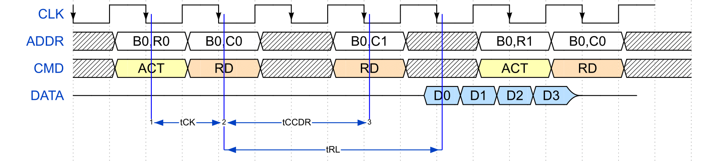

# RRAMSpec - A RRAM Area, Energy and Timing Generator


If you use **RRAMSpec** in your research, we would appreciate a citation to:

**RRAMSpec: A Design Space Exploration Framework for High Density Resistive RAM**,
D. M. Mathew, A. Chinazzo, C. Weis, M. Jung, B. Giraud, P. Vivet, A. Levisse, N. Wehn.,
*International Conference on Embedded Computer Systems Architectures Modeling and Simulation (SAMOS)*, July, 2019, Samos Island, Greece.

For more information about our other tools please visit: http://www.uni-kl.de/3d-dram/tools/

## LICENSE
Copyright (c) 2019, University of Kaiserslautern
All rights reserved.

Redistribution and use in source and binary forms, with or without
modification, are permitted provided that the following conditions are
met:

1. Redistributions of source code must retain the above copyright notice,
   this list of conditions and the following disclaimer.

2. Redistributions in binary form must reproduce the above copyright
   notice, this list of conditions and the following disclaimer in the
   documentation and/or other materials provided with the distribution.

3. Neither the name of the copyright holder nor the names of its
   contributors may be used to endorse or promote products derived from
   this software without specific prior written permission.

THIS SOFTWARE IS PROVIDED BY THE COPYRIGHT HOLDERS AND CONTRIBUTORS
"AS IS" AND ANY EXPRESS OR IMPLIED WARRANTIES, INCLUDING, BUT NOT LIMITED
TO, THE IMPLIED WARRANTIES OF MERCHANTABILITY AND FITNESS FOR A PARTICULAR
PURPOSE ARE DISCLAIMED. IN NO EVENT SHALL THE COPYRIGHT HOLDER
OR CONTRIBUTORS BE LIABLE FOR ANY DIRECT, INDIRECT, INCIDENTAL, SPECIAL,
EXEMPLARY, OR CONSEQUENTIAL DAMAGES (INCLUDING, BUT NOT LIMITED TO,
PROCUREMENT OF SUBSTITUTE GOODS OR SERVICES; LOSS OF USE, DATA, OR
PROFITS; OR BUSINESS INTERRUPTION) HOWEVER CAUSED AND ON ANY THEORY OF
LIABILITY, WHETHER IN CONTRACT, STRICT LIABILITY, OR TORT (INCLUDING
NEGLIGENCE OR OTHERWISE) ARISING IN ANY WAY OUT OF THE USE OF THIS
SOFTWARE, EVEN IF ADVISED OF THE POSSIBILITY OF SUCH DAMAGE.

Authors: Andr'e L. Chinazzo, Deepak M. Mathew, Christian Weis

## Installing

RRAMSpec requires some libraries from [boost](http://www.boost.org/). If you do not have it or the version you have is older than the 1.67, please follow the first four (4) steps from their [getting started](http://www.boost.org/doc/libs/1_67_0/more/getting_started/unix-variants.html) section.

RRAMSpec is built as a Qt Creator project, therefore requiring the `qmake` tool. If you do not have Qt installed, you can find it [here](http://www.qt.io/download).


### Cloning from github (recursive to get submodules!)
``` bash
    git clone --recursive <URL>
```

### Building RRAMSpec

1. If your default Boost libraries version is older than the one mentioned at Installing, you need to include the path for the newer version in the project file:
  1. Open the project file `RRAMSpec.pro` in your preferred text editor
  2. Uncomment the following line: `INCLUDEPATH += /path/to/boost_x_xx_x`
  3. Edit it to include the absolute path (from `/`) of the newer Boost libraries version.
  4. Example: `INCLUDEPATH += /users/my_user/my_libs/boost_1_67_0`

2. To be sure RRAMSpec repository was properly cloned, build and run the program in test mode by using the script below!

``` bash
    ./runTests.sh
```

3. After getting the "No errors detected" message, you are ready to build RRAMSpec itself. To do that, simply run the [buildRRAMSpec.sh](buildRRAMSpec.sh) script:

``` bash
    ./buildRRAMSpec.sh
```

The executable is now available under `build/release/` by the name `rramspec`.

### Running RRAMSpec

The program expect as parameters (at least) a cell, a technology and an architecture description files. The flags `-cell`, `-tech` and `-arch` precede the cell, technology and architecture description files, respectively. The user may choose to write a configuration file, which is a plain text file in the same syntax as the command line arguments. It is important to keep in mind that everything written in the configuration file will be appended to the original arguments. The configuration file must be preceded by the flag `-conf`.

``` bash
    ./build/release/rramspec -cell <path/to/cellfilename> -tech <path/to/technologyfilename> -arch <path/to/parameterfilename>
```
or:
``` bash
    ./build/release/rramspec -conf <path/to/configurationfilename>
```

#### Examples:

``` bash
    ./build/release/rramspec -cell cells/test_cell.json -tech techs/test_tech.json -arch archs/test_arch.json
```
or:
``` bash
    ./build/release/rramspec -conf configs/test_config.txt
```

It is also possible to run multiple input files at once:

``` bash
    ./build/release/rramspec -conf <config1.txt> <config2.txt>
```
Note: the total number of cell, technology and architecture description files must be equal.

## Input Data

### RRAM Cell related inputs

| Parameter | Description |
|:------------:|:-----------:|
|Memory device HRS resistance [Ohm]|Resistance of the memory device (not the complete cell) when in High Resistance State.|
|Memory device LRS resistance [Ohm]|Resistance of the memory device (not the complete cell) when in Low Resistance State.|
|Selector model []|Matematical model of the selector device. Can be either *semiIdeal* or *IxV*.|
|Selector snap voltage [V]|Voltage from which the sel. dev. becomes highly conductive. Only considered if sel. dev. model is *semiIdeal*.|
|Selector leakage current [nA]|Leakage current that can flow through the sel. dev. even at low voltages. Only considered if sel. dev. model is *semiIdeal*.|
|Selector maximum current [nA]|Saturation current of the sel. device. Only considered if sel. dev. model is *semiIdeal*.|
|Selector voltage point <i> [V]|Voltage point <i> of the IxV curve. There must be a 0 point (0A at 0V). Only considered if sel. dev. model is *IxV*.|
|Selector current point <i> [V]|Current point <i> of the IxV curve. There must be a 0 point (0A at 0V). Only considered if sel. dev. model is *IxV*.|
|Cell set time C [ns]|Cell set time constant C<sub>SET</sub>: t<sub>SET</sub> = C<sub>SET</sub> x exp(-K<sub>SET</sub> x V<sub>CELL</sub>).|
|Cell set time K [V^-1]|Cell set time constant K<sub>SET</sub>: t<sub>SET</sub> = C<sub>SET</sub> x exp(-K<sub>SET</sub> x V<sub>CELL</sub>).|
|Cell set time [ns]|Cell set time. If given, it disables the dependence of t<sub>SET</sub> on V<sub>CELL</sub>.|
|Cell reset time C [ns]|Cell reset time constant C<sub>RESET</sub>: t<sub>RESET</sub> = C<sub>RESET</sub> x exp(-K<sub>RESET</sub> x V<sub>CELL</sub>).|
|Cell reset time K [V^-1]|Cell set time constant K<sub>RESET</sub>: t<sub>RESET</sub> = C<sub>RESET</sub> x exp(-K<sub>RESET</sub> x V<sub>CELL</sub>).|
|Cell reset time [ns]|Cell reset time. If given, it disables the dependence of t<sub>RESET</sub> on V<sub>CELL</sub>.|
|Cell set compliance current [nA]|Compliance current of SET operation.|
|LRS/HRS read current ratio []|Design ratio between the read current of a LRS and a HRS cell.|
|Cell width [nm]|Cell width (wordline direction).|
|Cell height [nm]|Cell width (bitline direction).|
|Cell to cell spacing [nm]|Minimum cell to cell spacing.|
|Cell thickness [nm]|Cell thickness (die direction).|


### RRAM Technology related inputs

| Parameter | Description |
|:------------:|:-----------:|
|Technology node [nm]|Name of the technology node. Assumed to be the minimal length of MOS gates.|
|Vcc [V]|Digital circuitry operating voltage.|
|Metal half pitch [nm]|Minimum metal width and metal to metal spacing.|
|Metal thickness [nm]|Metal thickness (die orientation).|
|Metal resistivity [Ohm m]|Nominal resistivity of the metal with minimum width and spacing.|
|Metal sheet resistance [Ohm]|Nominal resistance per square of the metal with minimum width and spacing.|
|Metal resistance per length [Ohm/nm]|Nominal resistance per length of the metal with minimum width and spacing.|
|Metal capacitance per length [aF/nm]|Nominal capacitance per length of the metal with minimum width and spacing.|
|MOS breakdown voltage [V]|Maximum operating voltage of the thicker oxide transistors.|
|Minimum PMOS channel length [nm]|Minimum channel length of the thicker oxide PMOS.|
|Minimum PMOS channel width [nm]|Minimum channel width of the thicker oxide PMOS.|
|Minimum NMOS channel length [nm]|Minimum channel length of the thicker oxide NMOS.|
|Minimum NMOS channel length [nm]|Minimum channel width of the thicker oxide NMOS.|
|Minimum length PMOS resistance-width product [kohm_nm]|Resistance-width product in the linear (triode) region of the minimum sized thicker oxide PMOS.|
|Minimum length NMOS resistance-width product [kohm_nm]|Resistance-width product in the linear (triode) region of the minimum sized thicker oxide NMOS.|
|Gate extension of active layer [nm]|Minimum gate (poly) extension off of the active layer.|
|Poly to poly spacing [nm]|Minimum poly to poly spacing.|
|Active layer extension of poly [nm]|Minimum active layer extension off of the poly (gate).|
|Active to active spacing [nm]|Minimum active layer to active layer spacing.|


### RRAM Architecture related inputs

| Parameter | Description |
|:------------:|:-----------:|
||**Crossbar array parameters**|
|Optimization mode []|Optimization mode for crossbar array size. *fixed* means no opt. at all. *perfomance* finds the minimum write time. *energy* finds the minimum write energy.|
|Wordline metal width [nm]|Force the wordline metal width. Must be >= than the metal half pitch.|
|Bitline metal width [nm]|Force the bitline metal width. Must be >= than the metal half pitch.|
|Crossbar array area [nm^2]|Force area of the crossbar array. Only valid if running in *fixed* mode.|
|Number of array columns []|Force a number of columns of the crossbar array. Only valid if running in *fixed* mode.|
|Number of array rows []|Force a number of rows of the crossbar array. Only valid if running in *fixed* mode.|
|Number of array columns []|Force a number of columns of the crossbar array. Only valid if running in *fixed* mode.|
|Number of array columns []|Force a number of columns of the crossbar array. Only valid if running in *fixed* mode.|
||**Bank parameters**|
|Bank capacity [Gb]|Total storage capacity of the RRAM bank.|
|Data bus width [bits]|Number of bits transferred per transaction.|
|Prefetch []|Number of data blocks read or written per command.|
|Minimum addressable block [bits]|Number of bits of the minimum addressable block.|


## Output Data

### Timings




| Abbreviation | Description | Unit |
|:------------:|:-----------:|:----:|
|tCCDR|Column to column delay for reads. From RD to RD.|ns|
|tCCDW|Column to column delay for reads. From WR to WR.|ns|
|tRL|Read latency. From RD to first data out.|ns|
|tWL|Write latency. From WR to first data in.|ns|


### Energies

| Abbreviation | Description | Unit |
|:------------:|:-----------:|:----:|
|eRD|Total energy spent per RD (read) command.|pJ|
|eWR|Total energy spent per WR (write) command.|pJ|
|Leakage Power|Background leakage power.|nW|

### Physical sizings

| Parameter | Description | Unit |
|:------------:|:-----------:|:----:|
|Wordlines per Subarray|Number of wordlines in each crossbar array.|-|
|Bitlines per Subarray|Number of bitlines in each crossbar array.|-|
|Subarrays per Row|Number of crossbar arrays in each Bank row.|-|
|Subarrays per Col|Number of crossbar arrays in each Bank column.|-|
|Subarray height|Height (bitline direction) of one crossbar array.|um|
|Subarray width|Width (wordline direction) of one crossbar array.|um|
|Bank height|Height (bitline direction) of the bank.|mm|
|Bank width|Width (wordline direction) of the bank.|mm|
|Bank area|Area of one channel.|(mm)^2|
